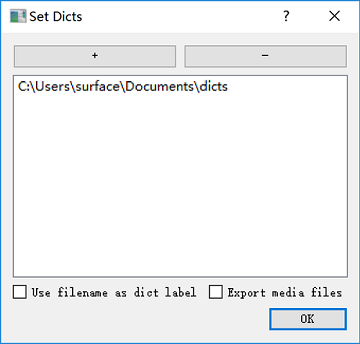
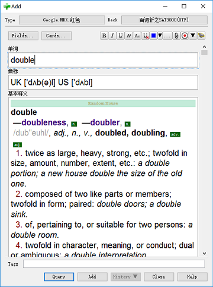

## [<u>User Guide</u>](README.md) &nbsp;&nbsp;&nbsp;&nbsp;[Develop Guide](develop.md) &nbsp;&nbsp;&nbsp;&nbsp;[Service Shop](shop.md) 

[中文说明](guide-cn.md)

## Main Features

This addon is developed to emancipate you from the tedious work of looking up words in dictionary and pasting the explanations to anki.

**Querying Words and Making Cards, IMMEDIATELY!**

**Support querying in mdx and stardict dictionaries**

**Support querying in web dictionaries (having provided many ones, and more others need to be [customized](develop.md))**

## Installation

1. Place "wordquery.py" and "wquery" folder in this repository in the anki add folder.    
**OR**
2. Use the installation code: 775418273

## How to Set

### Set Local Dictionaries

*If you do not use local dictionaries, you can skip this step.*

1. Click menu "Tool"->"WordQuery", popup the "Options" dialog

2. Click "Dict folders" button, add or remove the dictionary folders (support recursive searching)

    

   - "Use filename as dict label"
   - "Export media files" indicates if the audios will be exported.


### Set Note Type

In the "Options" dialog, click "Choose note type" and set the note type you want to use.


### Set the word field

Click the radio button to set the word field you want to query.


### Set the mappings from note fields to dictionary explanations


The "Dict" comoboxes are used to specify the dictionaries.

The "Dict fields" comoboxes are used to specify the available dictionary fields.

## How to Use

### "Add" dialog   

Once the word to query is ready, click "Query" button or popup the context menu and use relevant commands.

* "Query" button  
Query the explanations for all the fields.
* “Query All Fields” menu  
Query the explanations for all the fields.
* "Query Current Field" menu  
Query the explanation for current focused field.



### "Browse" window   

Select single word or multiple words, click menu "WordQuery"->"Query selected".


All above query actions can be trigged also by the shortcut (default "Ctrl+Q"), but you could change it through the addon's "Edit" menu.  
```python
# shortcut
shortcut = 'Ctrl+Q'
```


## Other Projects Used

- [mdict-query](https://github.com/mmjang/mdict-query)
- [pystardict](https://github.com/lig/pystardict)

