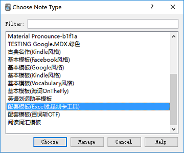

# WordQuery 插件(anki)

[Introduction in English](docs/introduction.md) *contributed by Li Tan*.

## 主要功能

1. 快速零散制卡 

   在添加卡片和编辑卡片界面，插件辅助完成单词释义的查询和自动填充。 

2. 批量制卡 

   在浏览器界面选择多个单词，插件辅助完成选中单词释义的批量查询和自动填充。 

3. 本地词典支持

   支持**mdx格式**词典和**stardict格式**词典。

4. 网络词典支持  

   支持网络词典的查询，目前内置有道、百词斩等插件。
   
   所有词典以插件形式实现，用户可自行定义、修改和删除。插件定义和实现方式可参考[该节](#词典服务插件定义)。
  
## 使用方法

### 安装

1. [https://github.com/finalion/WordQuery](https://github.com/finalion/WordQuery)下载并放到anki插件文件夹

2. 安装代码775418273

### 词典文件夹设置

1. “工具”菜单-->"WordQuery"，弹出设置界面；

2. 点击“词典文件夹”按钮，在弹出的对话框中通过“+”或“-”增加或删除文件夹，支持递归查找。

    

3. 其他设置    
   - 使用文件名作为词典名：不选中则使用词典中的特定标题字段作为词典名
   - 导出媒体文件：选中则导出词典解释中包含的**音频**

### 笔记类型选择

在设置界面中，点击“选择笔记类型”按钮，选择要设定的笔记类型；   



### 查询单词字段设置

单选框选中要查询的单词字段.

### 待填充词典字段与笔记区域的映射

为每个笔记区域映射待查询的词典以及词典字段：   


词典下拉框选项中包括三部分，各部分之间有分割线：

- 第一部分：“不是词典字段”
- 第二部分：设定文件夹中包含的可支持的本地词典
- 第三部分：网络词典

### 查询并填充释义
    
插件可在多种编辑模式下快速查询并添加单词释义。   

1. “添加笔记”界面和“编辑笔记”界面

    - 点击“Query”按钮查询并填充全部字段的释义；
    - 右键菜单“Query All Fields”查询并填充全部字段的释义；
    - 右键菜单“Query Current Field”查询并填充当前字段的释义；
    - 右键菜单“Options”查看修改笔记区域和词典字段的映射；

2. 浏览器

    - 选择多个卡片，工具栏菜单“WoryQuery”选择“查询选中单词”，查询并填充所有选中单词全部字段的释义；

    

    

所有操作均支持快捷键，默认为"Ctrl+Q"，可[修改](#快捷键自定义)。

## 其他Tips

### 快捷键自定义

“工具”菜单-->“插件”-->"wordquery"-->编辑，找到并修改快捷键设置:

```python
# shortcut
shortcut = 'Ctrl+Q'
```


## 词典服务插件定义

### 网络词典服务

### 实现类

1. 继承WebService
2. ```@register(label)``` 修饰类
   - 装饰器参数```label```作为词典标签，出现在词典下拉列表中

### 实现导出词典字段函数

1. ```@export(fld_name, order)``` 修饰导出词典字段函数
   - 装饰器参数```fld_name```为词典字段名称，出现在词典字段下拉列表中
   - 装饰器参数```order```为词典字段在下拉列表中的顺序，小号在上，大号在下

### 添加字段样式（可选）

1. ```@with_style(**kwargs)```修饰导出词典字段函数
2. 目前支持的可选参数包括```css```和```js```，其中css样式将插入到词典字段中，js代码将插入到笔记模板中

具体可参考[有道词典 youdao.py](wquery/service/youdao.py)实现方式。    


## 插件所使用的外部库

- [mdx词典解析](https://github.com/mmjang/mdict-query)
- [pystardict词典解析](https://github.com/lig/pystardict)

